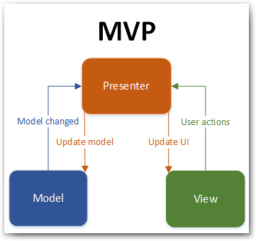

# MVP-Sample (Java) for Android

MVP is a user interface architectural pattern engineered to facilitate automated unit testing and improve the separation of concerns in presentation logic.

 

Project
-----
* `ApiClient.java` - Fake class to obtain the data.
* `Data.java` - Data model with the information to show in the table.
* `MainActivityImpl.java` - The presenter acts upon the model and the view.
* `MyAdapter.java` - The adapter that handle the RecyclerView.

Special Thanks
-----
* Uncle Bob

Developed By
-----

Antonio Corrales desarrollogit@gmail.com

License
-----

Copyright 2018 Antonio Corrales

    Licensed under the Apache License, Version 2.0 (the "License");
    you may not use this file except in compliance with the License.
    You may obtain a copy of the License at

       http://www.apache.org/licenses/LICENSE-2.0

    Unless required by applicable law or agreed to in writing, software
    distributed under the License is distributed on an "AS IS" BASIS,
    WITHOUT WARRANTIES OR CONDITIONS OF ANY KIND, either express or implied.
    See the License for the specific language governing permissions and
    limitations under the License.
